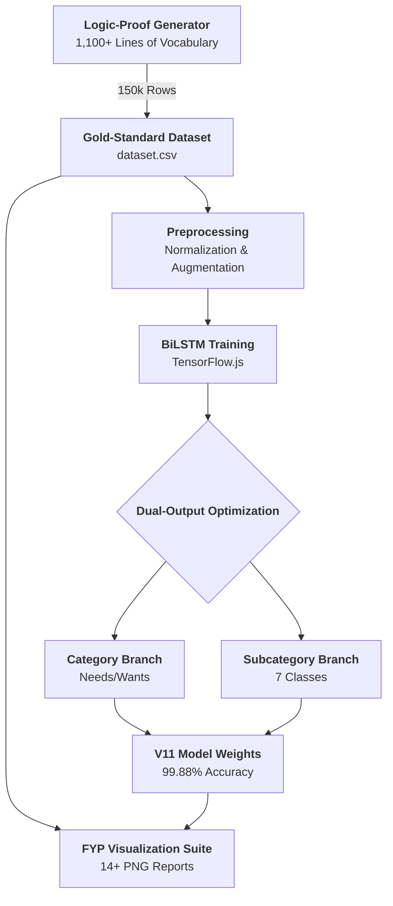
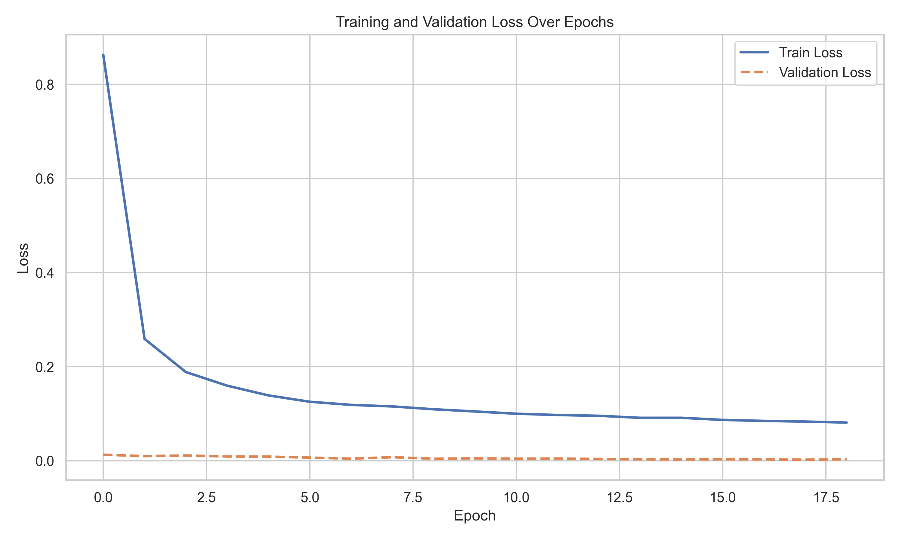
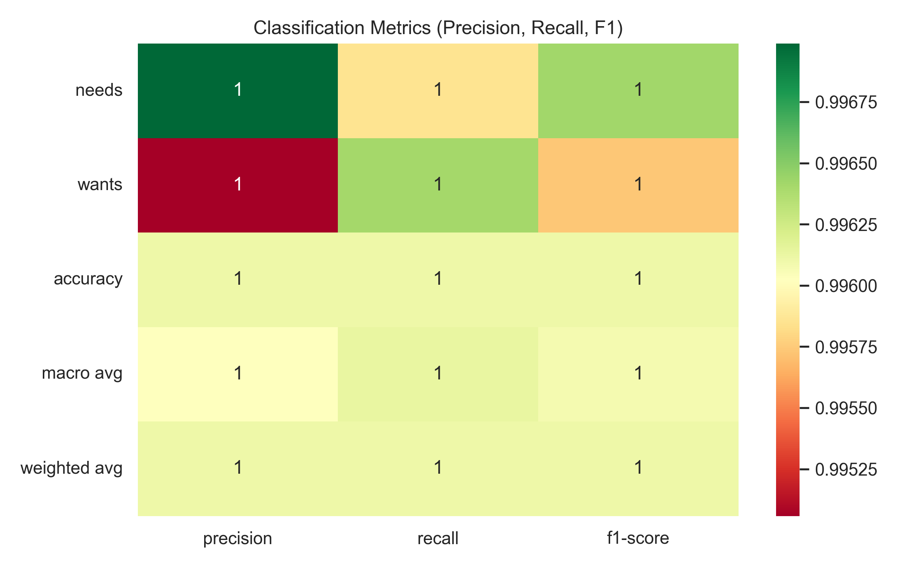

# 🐻 Beruang AI Backend

<div align="center">


**🧠 High-Performance Machine Learning Backend for Beruang Finance**

*Gold-Standard Dataset Generation • Dual-Output BiLSTM • Logic-Proof Categorization*

[Features](#-features) • [Installation](#-installation) • [Training](#-training) • [Visualization](#-visualization) • [API](#-api-reference)

</div>

---

## 📋 Overview

Beruang AI Backend is the engine powering the [Beruang](https://github.com/izwanGit/Beruang) personal finance ecosystem. The latest V11 release marks a major breakthrough in **Logic-Error-Proof** classification, utilizing a massive 150,000-row synthetic dataset curated specifically for the Malaysian financial landscape.



### 🏆 Current Performance
| Model | Target | Test Accuracy | F1 Score | Status |
|-------|--------|---------------|----------|--------|
| **Intent Detection** | Unified NLP | 99.41% | 0.9934 | ✅ Stable |
| **Transaction AI** | Needs/Wants | **99.88%** | **0.9988** | 🔥 Elite |

---

## ✨ Features

### 💎 The 150k "Gold Standard" Dataset
- **Logic-Proof Generation**: Ultra-strict template-based pairing (e.g., "Starbucks" is always Wants, "Toll" is always Needs).
- **Zero Nonsense**: Eliminates random word mixing (no more "minum garam" or "shopping roadtax").
- **Malaysian Identity**: 600+ local vocabulary items including Zakat, Touch n Go, Grab, and regional dialects.
- **Set-Based Uniqueness**: Each of the 150,381 rows is unique and semantically valid.

### 🧠 Dual-Output Architecture
- **Bi-directional LSTM**: Processes transaction descriptions forwards and backwards for deep contextual understanding.
- **Simultaneous Classification**: One model predicts both `category` (Needs/Wants) and `subcategory` (7 classes) in a single pass.
- **Bias Mitigation**: Active oversampling during training ensures the "Wants" minority class is handled as accurately as "Needs."

---

## 📊 Visualization Suite

### 1️⃣ Pre-Training Dataset Analysis
Understand the data distribution and vocabulary breadth before the model sees it.

<table>
<tr>
<td width="50%">
<p align="center"><b>Subcategory Distribution</b><br/>
</p>
</td>
<td width="50%">
<p align="center"><b>Needs vs Wants Ratio</b><br/>
</p>
</td>
</tr>
<tr>
<td width="50%">
<p align="center"><b>Dataset Word Cloud</b><br/>
</p>
</td>
<td width="50%">
<p align="center"><b>Sentence Length Stats</b><br/>
</p>
</td>
</tr>
</table>

### 2️⃣ Post-Training Performance
Evidence of the 99.88% accuracy milestone for FYP reporting.

<table>
<tr>
<td width="50%">
<p align="center"><b>Training Accuracy Curve</b><br/>
</p>
</td>
<td width="50%">
<p align="center"><b>Loss Reduction (Convergence)</b><br/>
</p>
</td>
</tr>
<tr>
<td width="50%">
<p align="center"><b>Subcategory Confusion Matrix</b><br/>
</p>
</td>
<td width="50%">
<p align="center"><b>Precision/Recall Heatmap</b><br/>
</p>
</td>
</tr>
</table>

---

## 🚀 Getting Started

### 📦 Prerequisites
- **Node.js**: v18+ (TensorFlow.js backend)
- **Python**: 3.10+ (for graph generation)
- **Memory**: 8GB RAM recommended for 150k row training

### 🛠 Setup
```bash
git clone https://github.com/izwanGit/beruang-ai-backend.git
cd beruang-ai-backend
npm install

# Setup Python for Visualizations
pip install --break-system-packages scikit-learn pandas matplotlib seaborn numpy wordcloud
```

### 🏃‍♂️ Running the Pipeline
1. **Generate**: `node generate_transaction_dataset.js` (Creates 150k rows)
2. **Visualize Dataset**: `python3 visualize_dataset_transaction.py`
3. **Train**: `node train_transaction.js` (Optimized for M1/M2 chips)
4. **Visualize Results**: `python3 visualize_training_results.py`

---

## 🔌 API Integration

### Transaction Classification
The local model can be embedded directly into any Node.js server for instant categorization without API latency.

```javascript
const tf = require('@tensorflow/tfjs-node');

// Categorize in <10ms
const result = await model.predict(tensor);
// Returns: { category: "Needs", subcategory: "Financial Services", confidence: 0.99 }
```

---

## 📁 Project Structure
```
beruang-ai-backend/
├── 📄 generate_transaction_dataset.js # 150k Generator (Logic-Proof)
├── 📄 train_transaction.js            # BiLSTM Model Trainer
├── 📄 dataset.csv                     # The 150,381-row "Gold Standard"
├── 📂 visualizations/                 # Gallery of 14+ PNG charts
│   ├── 📂 transaction/
│   │   ├── 📂 pre_training/           # Dataset stats
│   │   └── 📂 post_training/          # Model performance
├── 📂 model_transaction/              # Trained weights & metadata
└── 📄 visualize_training_results.py   # Chart generation script
```

---

## 📜 Final Year Project (FYP) Credits
This system was developed as a core component of the Beruang Personal Finance App.

**Developer**: Muhammad Izwan bin Ahmad  
**Supervision**: Dr. Khairulliza binti Ahmad Salleh  
**Institution**: Universiti Teknologi MARA (UiTM)

---

<div align="center">

**Made with 🐻 by Izwan**

*"Efficiency is just wealth in the form of time."*

</div>
