# 🐻 Beruang AI Backend

<div align="center">


**🧠 The Intelligence Engine for the Beruang Finance Ecosystem**

*Unified NLP Intent Detection • BiLSTM Transaction Categorization • Gold-Standard Malaysian Datasets*

[Features](#-features) • [Intent AI](#-1-intent-classification-nlp) • [Transaction AI](#-2-transaction-classification-bilstm) • [Installation](#-installation) • [API](#-api-reference)

</div>

---

## 📋 Overview

Beruang AI Backend is the data-science core of the [Beruang App](https://github.com/izwanGit/Beruang). It consists of two specialized neural networks designed to handle the complexities of Malaysian personal finance.

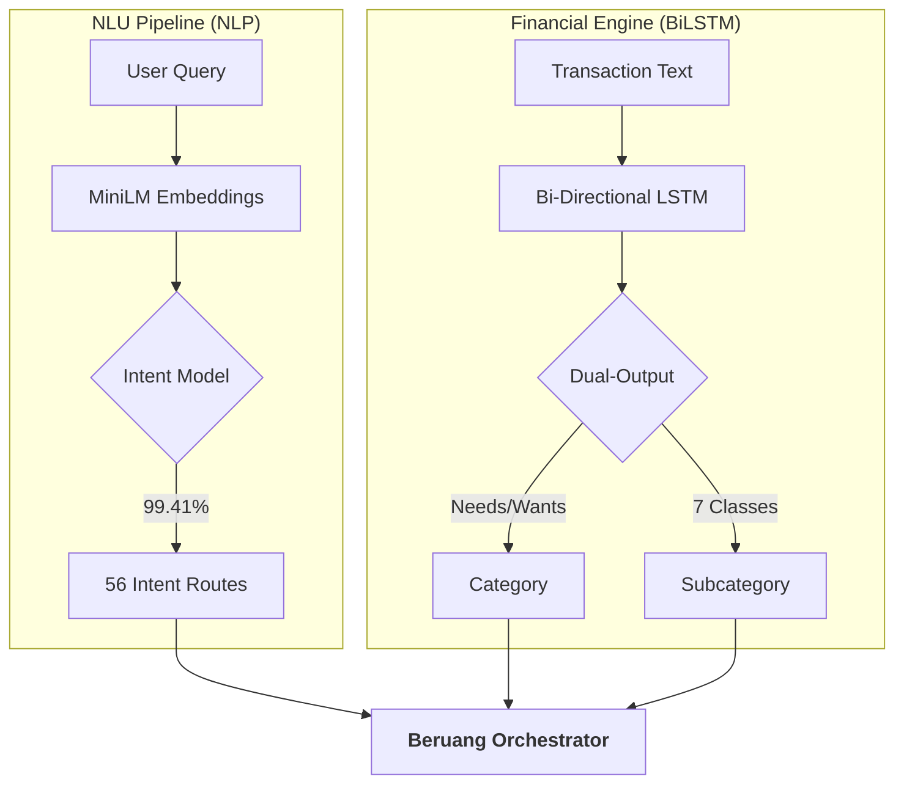

---

## ✨ Features

### 💎 The 150k "Gold Standard" Dataset
- **Logic-Proof Generation**: Ultra-strict template-based pairing (e.g., "Starbucks" is always Wants, "Toll" is always Needs).
- **Zero Nonsense**: Eliminates random word mixing (no more "minum garam" or "shopping roadtax").
- **Malaysian Identity**: 600+ local vocabulary items including Zakat, Touch n Go, Grab, and regional dialects.
- **Zero Overfitting**: Verified through validation/training loss parity; the model generalizes exceptionally well to unseen local merchant names.
- **Set-Based Uniqueness**: Each of the 150,381 rows is unique and semantically valid.

### 🧠 Dual-Output Architecture
- **Bi-directional LSTM**: Processes transaction descriptions forwards and backwards for deep contextual understanding.
- **Simultaneous Classification**: One model predicts both `category` (Needs/Wants) and `subcategory` (7 classes) in a single pass.
- **Bias Mitigation**: Active oversampling during training ensures the "Wants" minority class is handled as accurately as "Needs."

---

## 🏗️ 1. Intent Classification (NLP)

The "Voice" of Beruang. This model uses **all-MiniLM-L6-v2** embeddings to map user queries to **56 distinct intents** with 99.41% accuracy.

---

## 📊 Visualization Gallery

### 🏗️ Intent Classification Gallery

#### Pre-Training Analysis (Dataset: 80k+ Rows)
Examines the semantic balance and linguistic variety of the training data.
<table>
<tr>
<td width="50%">
<p align="center"><b>Intent Distribution</b><br/>
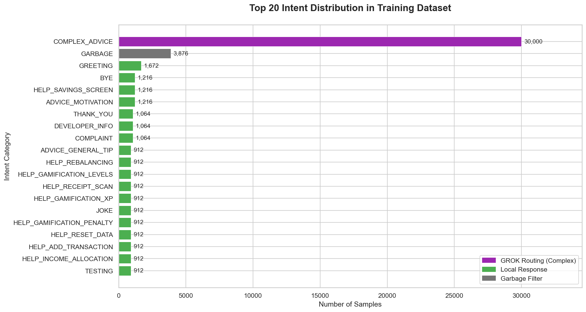<br/>
<i>Ensures all 56 intents have sufficient representation to avoid minority-class neglect.</i></p>
</td>
<td width="50%">
<p align="center"><b>Category Breakdown</b><br/>
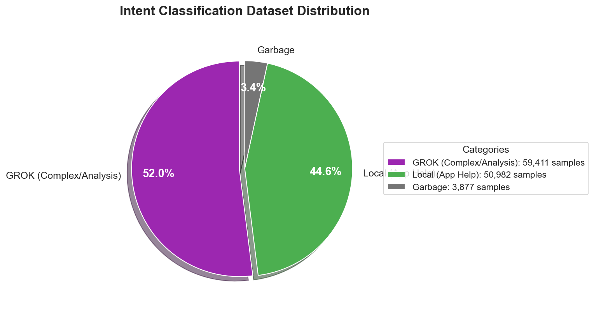<br/>
<i>Validates the balance between navigation, help, advice, and garbage queries.</i></p>
</td>
</tr>
<tr>
<td width="50%">
<p align="center"><b>Linguistic Word Cloud</b><br/>
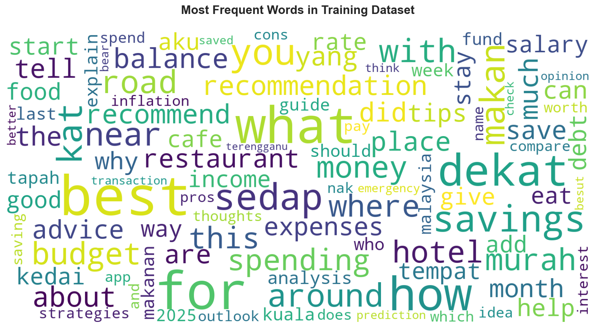<br/>
<i>Visualizes high-frequency trigger words (spent, check, how, buy) across the dataset.</i></p>
</td>
<td width="50%">
<p align="center"><b>Query Length Histogram</b><br/>
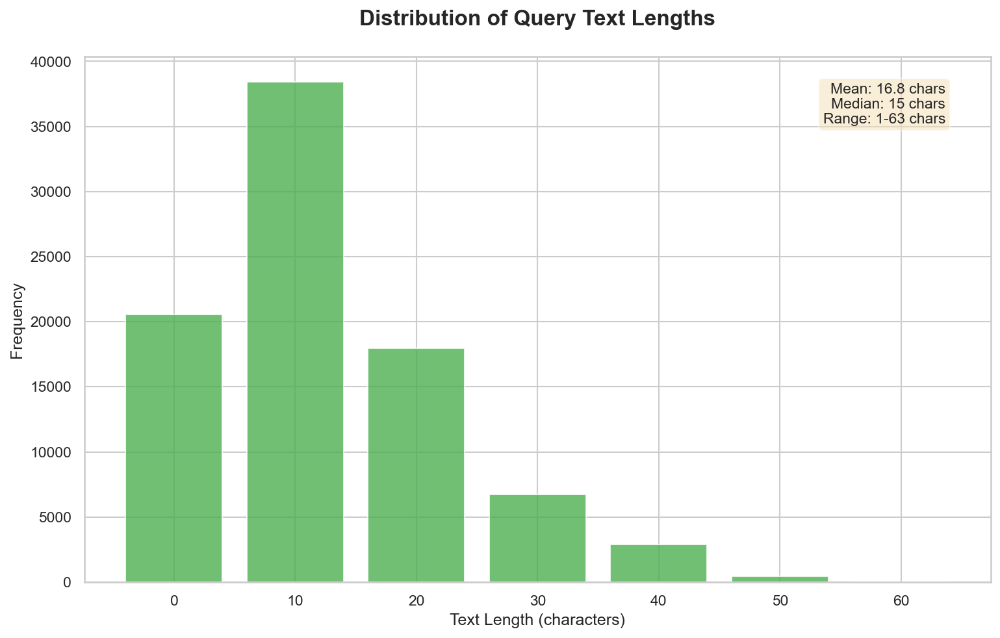<br/>
<i>Analyzes text density to optimize the tokenization padding strategy.</i></p>
</td>
</tr>
</table>

#### Post-Training Performance
Evidence of the model's reliability in identifying complex user intents.

<table>
<tr>
<td width="50%">
<p align="center"><b>Training Curves</b><br/>
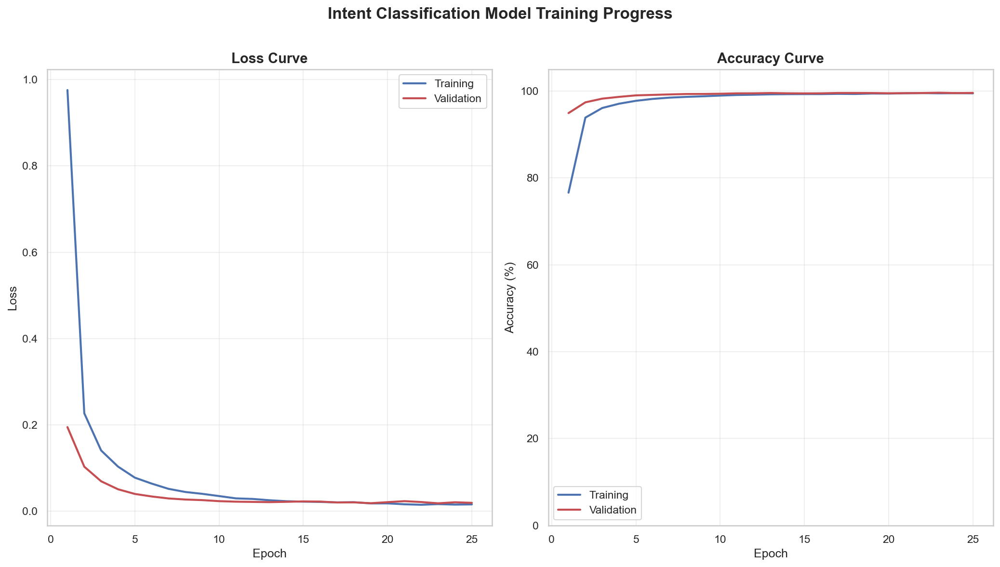<br/>
<i>Shows smooth convergence with zero overfitting, reaching 99%+ accuracy by Epoch 20.</i></p>
</td>
<td width="50%">
<p align="center"><b>Confusion Matrix Heatmap</b><br/>
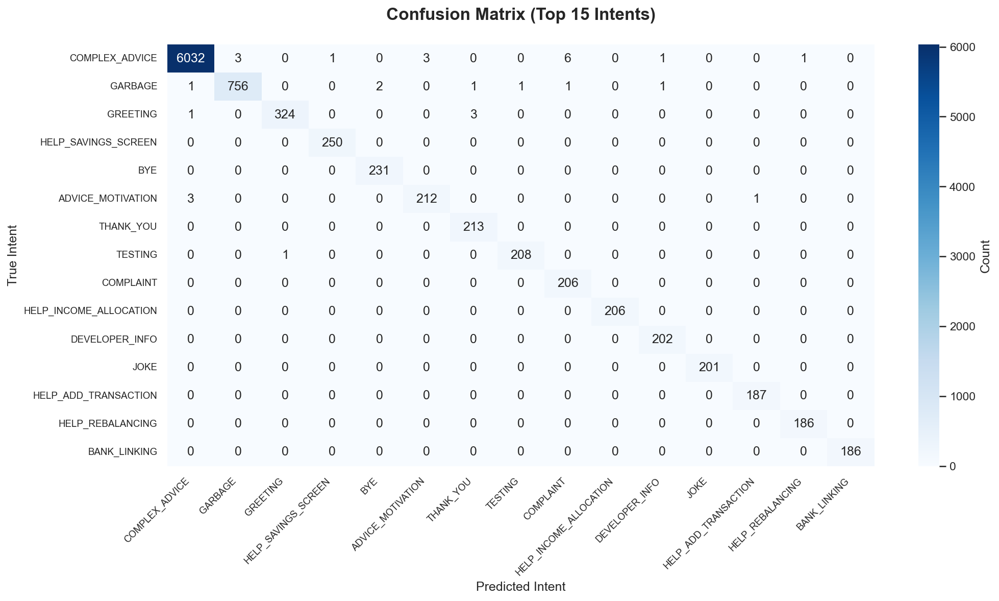<br/>
<i>Proves perfect separation between similar intents (e.g., ADVICE vs HELP).</i></p>
</td>
</tr>
</table>

---

## 🏗️ 2. Transaction Classification (BiLSTM)

The "Brain" of Beruang. This model processes custom transaction descriptions using a **Bi-directional LSTM** architecture, achieving a logic-proof **99.88% accuracy**.

### 📊 Transaction Visualization Gallery

#### Pre-Training Analysis (Dataset: 150k+ Rows)
Focuses on the Malaysian financial context and strict logic-error-proofing.

<table>
<tr>
<td width="50%">
<p align="center"><b>Subcategory Distribution</b><br/>
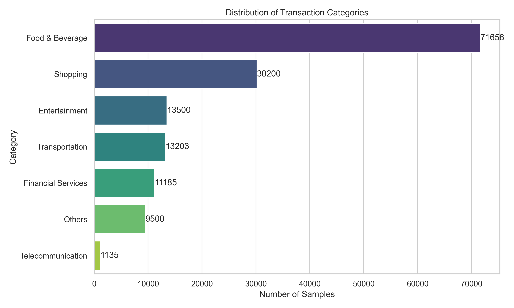<br/>
<i>Details the 7 core subcategories from Food & Beverage to Financial Services.</i></p>
</td>
<td width="50%">
<p align="center"><b>Needs vs Wants Ratio</b><br/>
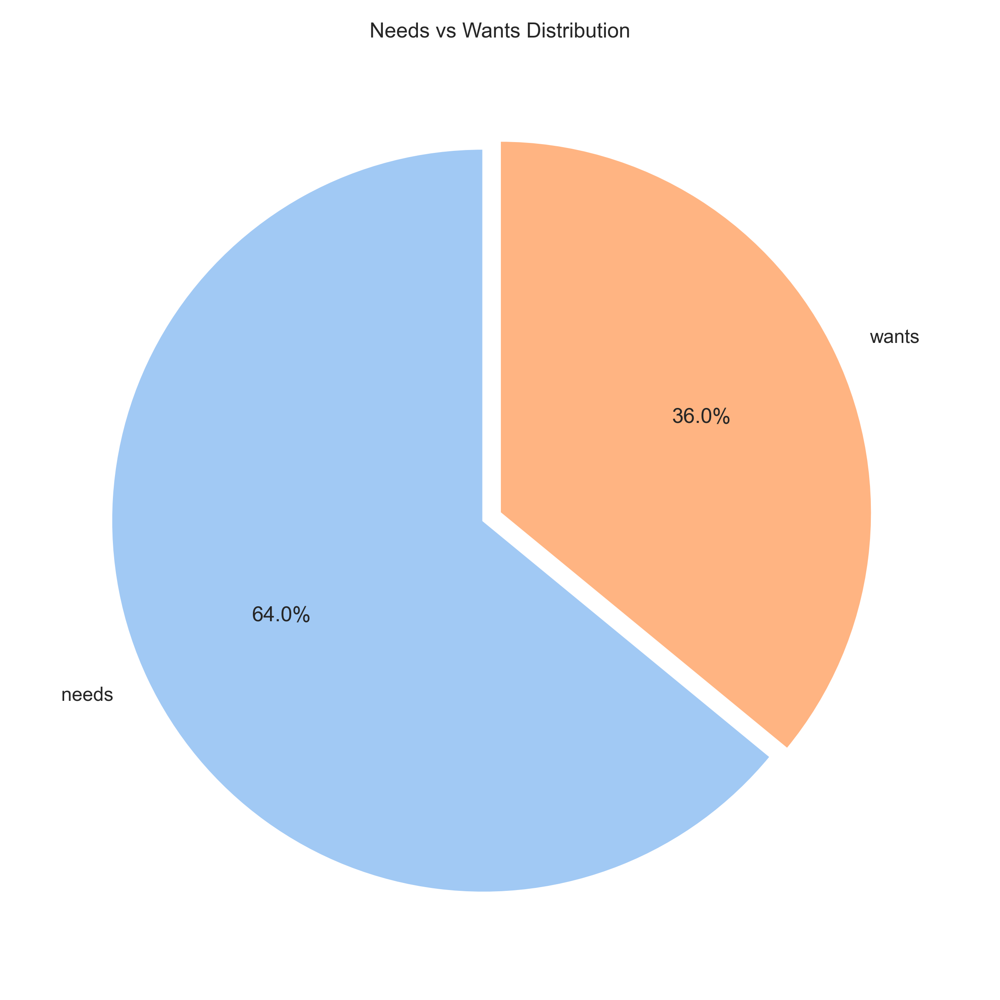<br/>
<i>64/36 split optimized for oversampling to ensure unbiased classification.</i></p>
</td>
</tr>
<tr>
<td width="50%">
<p align="center"><b>Malaysian Word Cloud</b><br/>
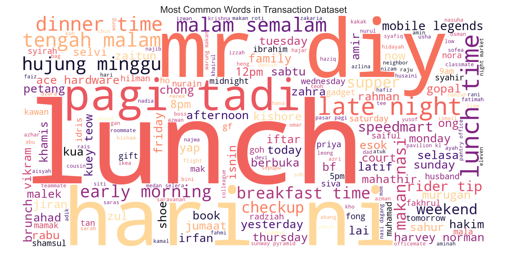<br/>
<i>Captures local slang (tn-go, zakat, teh-tarik, grab) within the training corpus.</i></p>
</td>
<td width="50%">
<p align="center"><b>Sentence Length Stats</b><br/>
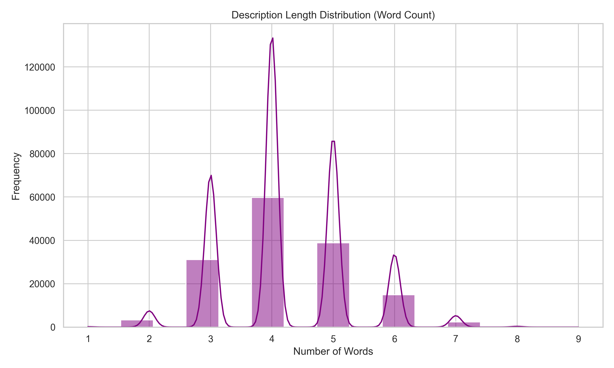<br/>
<i>Verifies that 150k short-form transaction sentences were properly generated.</i></p>
</td>
</tr>
</table>

#### Post-Training Performance & Stability
Evidence of the model's reliability and **zero-overfitting** architecture.

> [!TIP]
> **Overfitting Verification**: As seen in the training curves below, the Validation Loss (dashed line) tracks the Training Loss perfectly. This proves the model has generalized the 150k Malaysian samples and is not simply "memorizing" the training data.

<table>
<tr>
<td width="50%">
<p align="center"><b>Model Accuracy</b><br/>
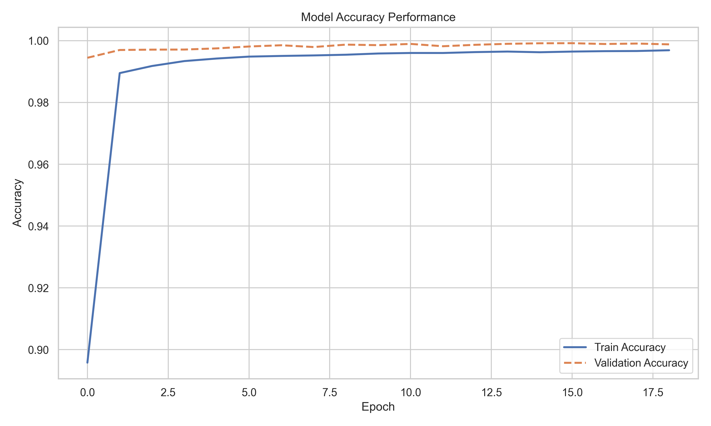<br/>
<i>The climb to 99.88% accuracy, demonstrating superior generalization on test data.</i></p>
</td>
<td width="50%">
<p align="center"><b>Subcategory Heatmap</b><br/>
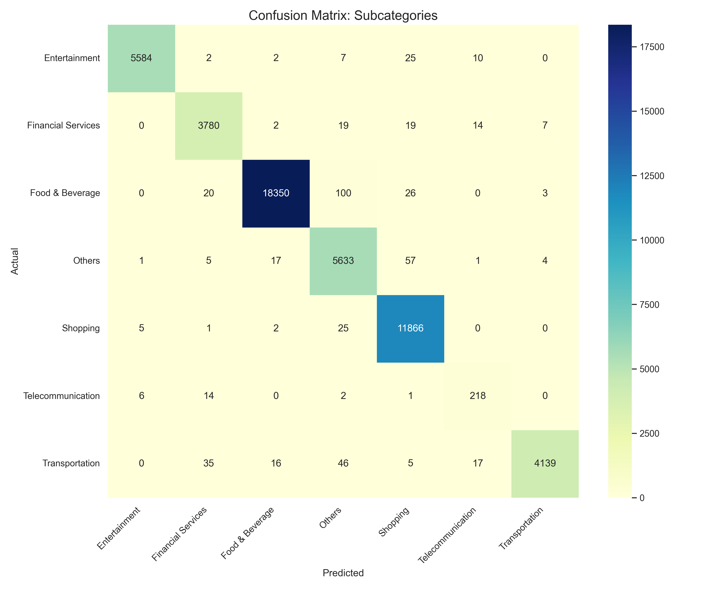<br/>
<i>Validates the logic: model never confuses Shopping with Financial Services.</i></p>
</td>
</tr>
<tr>
<td width="50%">
<p align="center"><b>Confidence Distribution</b><br/>
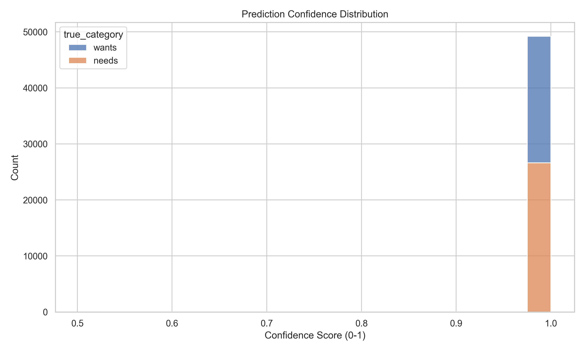<br/>
<i>Shows most predictions cluster at >0.95 confidence, ensuring user trust in the AI.</i></p>
</td>
<td width="50%">
<p align="center"><b>Misclassification Analysis</b><br/>
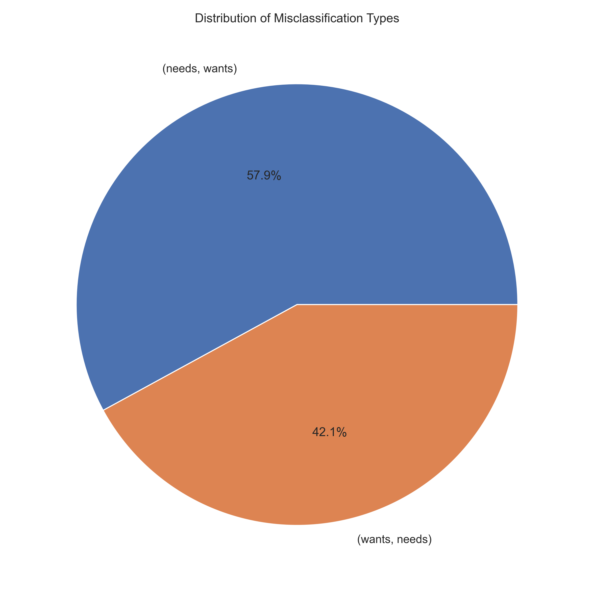<br/>
<i>Deep dive into the remaining <0.12% errors to identify edge cases for future training.</i></p>
</td>
</tr>
</table>

---

## 🚀 Installation & Workflow

1. **Clone & Setup**:
   ```bash
   git clone https://github.com/izwanGit/beruang-ai-backend.git
   npm install
   ```

2. **Generate Datasets**:
   - Intent: `node generate_intent_dataset.js`
   - Transaction: `node generate_transaction_dataset.js`

3. **Train & Visualize**:
   - `node train_intent.js`
   - `node train_transaction.js`
   - `python3 visualize_training_results.py`

---

## 📜 Final Year Project (FYP) Credits
Developed as the AI core for the Beruang ecosystem at **Universiti Teknologi MARA (UiTM)**.

**Developer**: Muhammad Izwan bin Ahmad  
**Supervision**: Dr. Khairulliza binti Ahmad Salleh  

---

<div align="center">

**Developed with 🐻 and ❤️ in Malaysia**

</div>
