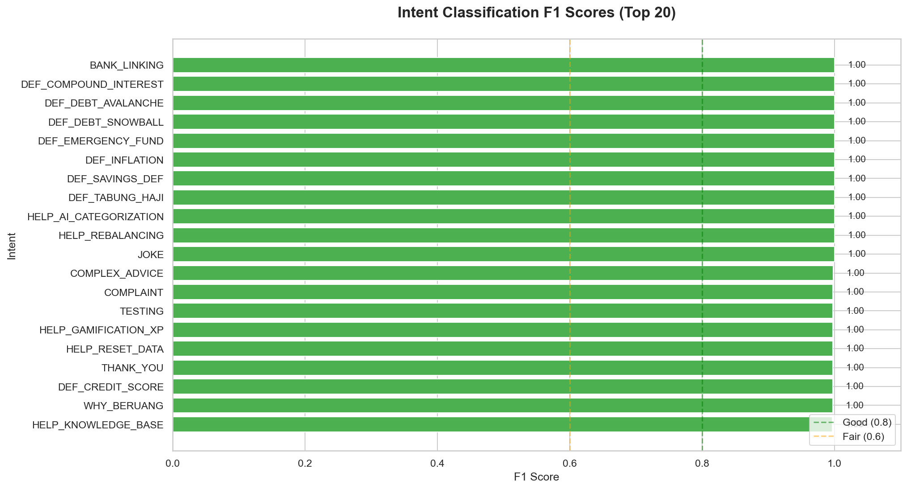

# 🐻 Beruang AI Backend

<div align="center">


**🧠 Machine Learning Backend for Beruang Personal Finance App**

*Intelligent Intent Classification & Transaction Categorization*

[Features](#-features) • [Installation](#-installation) • [Training](#-training) • [Visualization](#-visualization) • [API](#-api-reference)

</div>

---

## 📋 Overview

Beruang AI Backend is the machine learning engine powering the [Beruang](https://github.com/izwanGit/Beruang) personal finance app. It provides two key AI capabilities:

| Model | Purpose | Accuracy |
|-------|---------|----------|
| **Intent Classification** | Routes user queries to appropriate handlers | 99.41% |
| **Transaction Categorization** | Auto-categorizes expenses (Needs/Wants/Savings) | 95%+ |

---

## ✨ Features

### 🎯 Intent Classification (V7 - Logic Error Proof)
- **56 Intent Categories** covering app navigation, definitions, and complex advice
- **GROK Routing** - Automatically routes transaction/balance queries to AI analysis
- **Temporal Awareness** - Detects date-based queries (yesterday, last month)
- **Typo Tolerance** - Trained with realistic user input variations

### 📊 Transaction Categorization
- **50/30/20 Rule** - Classifies into Needs, Wants, Savings
- **15 Subcategories** - Food, Transport, Entertainment, etc.
- **Malaysian Context** - Trained on local merchant names and slang

### 📈 FYP Visualization Suite
- Pre-training dataset analysis charts
- Training curves (loss, accuracy)
- Confusion matrix heatmaps
- Classification reports

---

## 🚀 Installation

### Prerequisites
- Node.js ≥ 18.0.0
- Python 3.10+ (for visualizations)
- 4GB+ RAM (for training)

### Setup

```bash
# Clone the repository
git clone https://github.com/izwanGit/beruang-ai-backend.git
cd beruang-ai-backend

# Install dependencies
npm install

# (Optional) Set up Python visualization environment
python3 -m venv venv
source venv/bin/activate  # On Windows: venv\Scripts\activate
pip install matplotlib seaborn pandas numpy wordcloud pillow
```

---

## 🧠 Training

### Intent Classification Model

#### Step 1: Generate Dataset
```bash
node generate_intent_dataset.js
```

This generates `chat_intents.csv` with 78,564 samples covering:
- Transaction queries → GROK routing
- Balance queries → GROK routing
- Navigation commands → Local responses
- App help questions → Local responses
- Garbage filtering

#### Step 2: Visualize Dataset (Optional)
```bash
node visualize_dataset.js
source venv/bin/activate && python generate_charts.py
```

#### Step 3: Train Model
```bash
node train_intent.js
```

Training takes ~30-60 minutes and outputs:
- `model_intent/` - TensorFlow.js model files
- `visualizations/intent/` - Training metrics and charts

#### Step 4: Generate Training Charts
```bash
source venv/bin/activate && python generate_training_charts.py
```

#### Step 5: Test Model
```bash
node test_intent.js
```

---

## 📊 Visualization

### Pre-Training Analysis

<table>
<tr>
<td width="50%">

#### Category Distribution


</td>
<td width="50%">

#### Intent Distribution


</td>
</tr>
<tr>
<td width="50%">

#### Text Length Distribution


</td>
<td width="50%">

#### Word Cloud


</td>
</tr>
</table>

### Post-Training Results

<table>
<tr>
<td width="50%">

#### Training Curves


</td>
<td width="50%">

#### Confusion Matrix


</td>
</tr>
<tr>
<td width="50%">

#### F1 Scores by Intent


</td>
<td width="50%">

#### Final Metrics


</td>
</tr>
</table>

---

## 📁 Project Structure

```
beruang-ai-backend/
├── 📂 model_intent/              # Trained intent model
│   ├── model.json
│   ├── weights.bin
│   └── metadata.json
├── 📂 model_transaction/         # Trained transaction model
│   ├── model.json
│   └── weights.bin
├── 📂 visualizations/
│   ├── 📂 intent/
│   │   ├── 📂 pre_training/      # Dataset analysis charts
│   │   ├── 📂 post_training/     # Training result charts
│   │   └── 📂 data/              # JSON/CSV exports
│   └── 📂 transaction/           # (Future) Transaction model charts
├── 📄 generate_intent_dataset.js # Dataset generator V7
├── 📄 train_intent.js            # Model trainer with viz export
├── 📄 test_intent.js             # Critical test cases
├── 📄 visualize_dataset.js       # Pre-training analysis
├── 📄 generate_charts.py         # Python chart generator
├── 📄 generate_training_charts.py # Post-training charts
├── 📄 responses.json             # Intent patterns & responses
├── 📄 chat_intents.csv           # Generated training dataset
└── 📄 dataset.csv                # Transaction training data
```

---

## 🔌 API Reference

### Intent Prediction

```javascript
const { pipeline } = require('@xenova/transformers');
const tf = require('@tensorflow/tfjs-node');

// Load model
const model = await tf.loadLayersModel('file://./model_intent/model.json');
const extractor = await pipeline('feature-extraction', 'Xenova/all-MiniLM-L6-v2');

// Predict intent
const text = "what did i spend yesterday";
const embedding = await extractor(text, { pooling: 'mean', normalize: true });
const tensor = tf.tensor2d([Array.from(embedding.data)]);
const prediction = model.predict(tensor);
const intentIndex = prediction.argMax(-1).dataSync()[0];
// Returns: COMPLEX_ADVICE (routes to GROK)
```

### Transaction Categorization

```javascript
// Similar pattern for transaction model
const text = "Grab Food nasi lemak";
// Returns: { category: "Wants", subcategory: "Food_Delivery" }
```

---

## 📊 Model Performance

### Intent Classification V7

| Metric | Value |
|--------|-------|
| **Overall Accuracy** | 99.41% |
| **Macro F1 Score** | 0.9934 |
| **Training Samples** | 78,564 |
| **Intent Categories** | 56 |
| **Epochs** | 25 |
| **Validation Split** | 20% |

### Critical Bug Fixes in V7

| Query | V6 (Broken) | V7 (Fixed) |
|-------|-------------|------------|
| "what did i do yesterday" | ❌ NAV_HOME | ✅ COMPLEX_ADVICE |
| "check my balance" | ❌ TESTING | ✅ COMPLEX_ADVICE |
| "testing" | ❌ GARBAGE | ✅ TESTING |
| "idk" | ❌ GARBAGE | ✅ COMPLEX_ADVICE |

---

## 🧪 Test Results

```
📊 TEST SUMMARY
──────────────────────────────────────────────────
Total Tests:  51
Passed:       49 (96.1%)
Failed:       2 (3.9%)

📋 BY CATEGORY
──────────────────────────────────────────────────
Transaction Queries    8/8 (100%) ✅
Balance Queries        5/5 (100%) ✅
Navigation             6/7 (86%)
App Help               7/8 (88%)
Definitions            6/6 (100%) ✅
Complex Advice         4/4 (100%) ✅
Garbage Filter         3/3 (100%) ✅
System Check           3/3 (100%) ✅
```

---

## 🛠️ Technologies

| Technology | Purpose |
|------------|---------|
| **TensorFlow.js** | Neural network training & inference |
| **Xenova Transformers** | MiniLM sentence embeddings |
| **Node.js** | Runtime environment |
| **Python + Matplotlib** | Visualization generation |
| **Seaborn** | Statistical visualizations |
| **WordCloud** | Word frequency visualization |

---

## 📜 License

This project is part of a Final Year Project (FYP) at **Universiti Teknologi MARA (UiTM)**.

**Developed by:** Muhammad Izwan bin Ahmad  
**Supervised by:** Dr. Khairulliza binti Ahmad Salleh

---

## 🔗 Related Repositories

- **[Beruang App](https://github.com/izwanGit/Beruang)** - React Native mobile app
- **[Beruang Server](https://github.com/izwanGit/beruang-server)** - Backend API server

---

<div align="center">

**Made with 🐻 by Izwan**

*"Beruang" means bear in Malay – sounds like "Ber-wang" (has money)!*

</div>
